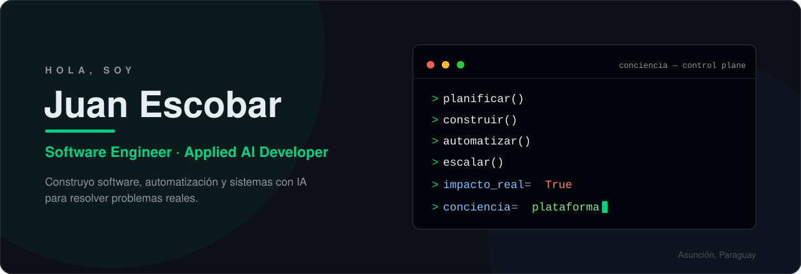

<!--
  Juan Escobar · GitHub Profile
  Software Developer · Applied AI · Automation
-->

<div align="center">



</div>

## Sobre mí

Hola, soy **Juan Escobar**, software developer enfocado en IA aplicada.

> Construyo software, automatización y sistemas inteligentes que conectan personas, procesos e información para generar impacto real.

Trabajo principalmente con **Python, FastAPI, React y TypeScript** sobre **Linux**, y me interesa especialmente la intersección entre ingeniería de software e inteligencia artificial: agentes, LLMs, RAG y sistemas con supervisión humana.

## Qué construyo

- **Productos de software** — de la idea al deploy: APIs, dashboards y sistemas end-to-end.
- **Automatización** — pipelines de datos, prospección de leads, integraciones y workflows que eliminan trabajo repetitivo.
- **Sistemas con IA** — agentes orquestados, búsqueda semántica, tool calling y ejecución human-in-the-loop, con gobernanza y observabilidad.
- **Infraestructura** — servicios en Docker sobre Linux, PostgreSQL, Redis y despliegues en producción.

## Proyectos destacados

### Conciencia — AI Control Plane for Autonomous Work

Plataforma open source que orquesta agentes de IA con misiones, herramientas, conocimiento y flujos de aprobación, con observabilidad total y ejecución human-in-the-loop. Integra MCP, múltiples runtimes de agentes y auditoría completa.

```text
Misión
  ↓
Agentes
  ↓
Herramientas
  ↓
Conocimiento
  ↓
Workflows
  ↓
Aprobaciones
  ↓
Observabilidad
```

[Repositorio](https://github.com/juanesscobar/conciencia) · [Sitio](https://conciencia-software.vercel.app)

### Otros proyectos

- **[LINTEAM](https://github.com/juanesscobar/linteam)** — sistema operativo organizacional de Lin Group: monolito modular con arquitectura limpia y dominio desacoplado de frameworks e infraestructura.
- **[LeadHunter](https://github.com/juanesscobar/conciencia)** — motor de prospección de leads: captura de fuentes públicas, deduplicación, enriquecimiento de datos y scheduler (módulo de Conciencia).
- **[Self-play AI Learning](https://github.com/juanesscobar/Self-playIAlearning)** — framework estilo AlphaZero (self-play + MCTS + redes neuronales) aplicado a decisiones médicas secuenciales en entornos simulados. Proyecto de investigación y aprendizaje.
- **[GeoAlert](https://github.com/juanesscobar/GeoAlert)** — API REST con FastAPI para alertas georreferenciadas.

## Stack tecnológico

**Lenguajes**


**Backend**


**Frontend**


<picture>
  <source media="(prefers-color-scheme: dark)" srcset="https://cdn.simpleicons.org/nextdotjs/FFFFFF" />
  
</picture>

**Infraestructura**


<picture>
  <source media="(prefers-color-scheme: dark)" srcset="https://cdn.simpleicons.org/linux/FFFFFF" />
  
</picture>


**AI Engineering**

`LLMs` · `Agentes de IA` · `Orquestación de agentes` · `Tool calling` · `RAG` · `Embeddings` · `Búsqueda semántica` · `Context engineering` · `Human-in-the-loop`

## Intereses en IA aplicada

- **Agentes y orquestación** — sistemas multi-agente, runtimes intercambiables, permisos y auditoría.
- **RAG y búsqueda semántica** — embeddings, retrieval y context engineering aplicados a datos reales.
- **Tool calling** — modelos conectados a herramientas y APIs del mundo real.
- **Human-in-the-loop** — cuándo delegar autonomía y cuándo requerir aprobación humana.
- **Autonomía con gobernanza** — sistemas que escalan sin perder control ni trazabilidad.

## Investigación y experimentación

Aprendo construyendo: cada proyecto empieza como un experimento con una hipótesis clara, se valida rápido y se descarta o escala según los resultados.

- Prototipos pequeños antes que arquitecturas grandes.
- Exploración activa de self-play y auto-mejora como línea de investigación.
- Documentar lo que funciona — y también lo que no.

## Cómo trabajo

- **De punta a punta** — problema, diseño, código, deploy y medición.
- **Automatización primero** — si una tarea se repite, se automatiza.
- **Supervisión humana en decisiones** — la autonomía necesita límites claros.
- **Código simple y legible** — prefiero lo mantenible a lo impresionante.
- **Pruebas y documentación** — donde agregan valor real.

## Servicios y colaboración

Construyo productos y sistemas con IA. Si tenés un problema real que el software pueda resolver — o un proyecto donde la automatización y los agentes sumen — escribime.

## Contacto

- GitHub: [juanesscobar](https://github.com/juanesscobar)
- Sitio: [conciencia-software.vercel.app](https://conciencia-software.vercel.app)
- Email: [escobarbvega.juanandres21@gmail.com](mailto:escobarbvega.juanandres21@gmail.com)

## Filosofía

> La tecnología es un medio, no un fin. Construir es la mejor forma de aprender.
